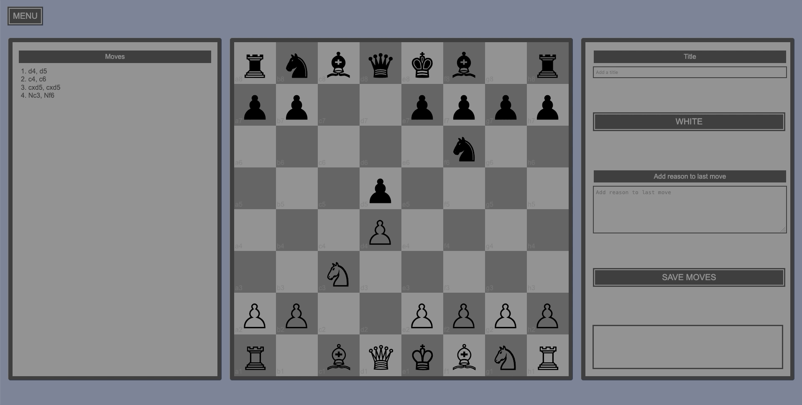
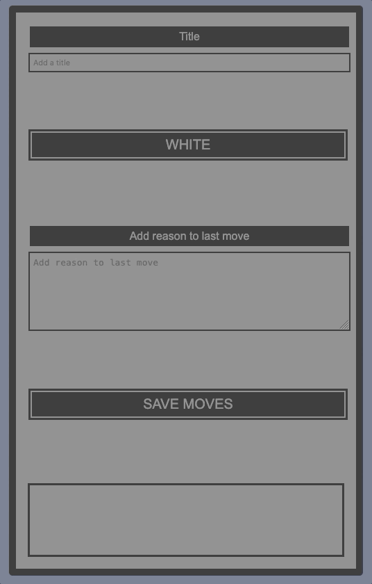
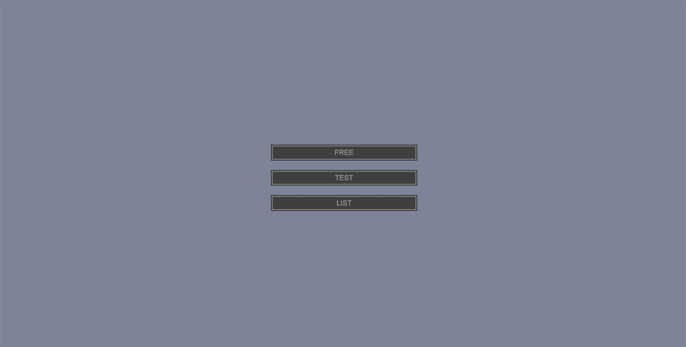

# Chess App

### _This app is a work in progress. Todo's listed at bottom_

---

## Free Mode

> Make moves for both sides
> 
> Choose the side that you want to practise this line as in Test Mode before saving
> 
> Enter a title and save it to the database
> 

---

## Test Mode

> A saved line will be selected at random, and a random number of moves will be made automatically. From here, it will wait for the user to make the correct move for their chosen colour
> 
> Incorrect moves are rejected
> 
> Correct moves trigger an automatic response: The computer will make the next move for the opposing colour
> 
> When the final correct move is made for the chosen colour, a different line will be loaded at random
> 

---

## TODOS

### App

- [ ] Add List Mode
- [ ] Automated script to setup db on other machines
- [ ] Theme switcher

---

### Free Mode

- [ ] Ensure no duplicate lines exist when making POST req (flatten & `===`)
- [ ] Message board confirmation/ error message when making POST req
- [ ] Reset gameClient & board on successful POST request

---

### Test Mode

- [ ] Utilize message board when wrong move or completing line
- [ ] Show hints on button press
- [ ] Show OAM on button press

---

### List Mode

- [ ] List all lines
- [ ] Option to delete line
- [ ] Option to play line (automatic moves)
- [ ] Option to select/deselect lines for test mode (will need to add a `selected` field to db table)
