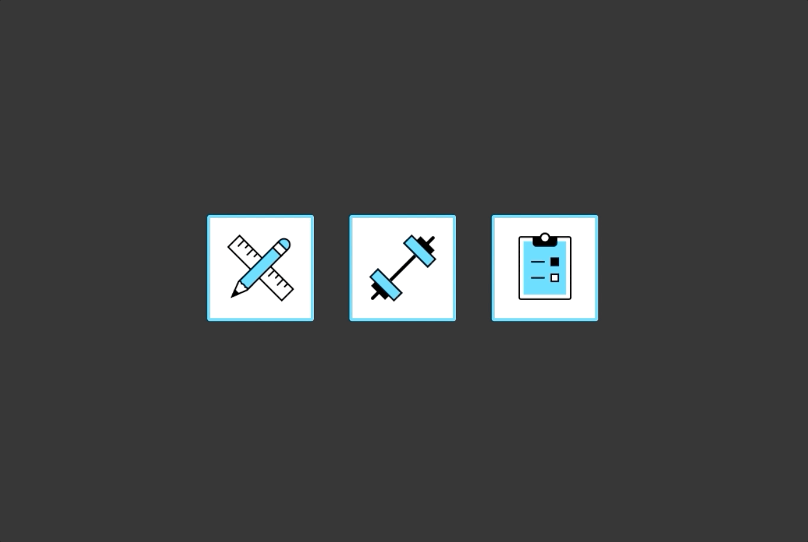

# Chess App

### _This app is a work in progress. Todo's listed at bottom_

---

## Free Mode

> Make moves for both sides, enter a title, pick the side you want to play as, and save
> 

## Test Mode

> A saved line will be selected at random, and a random number of moves will be made automatically. From here, it will wait for the user to make the correct move for their chosen colour
> 
> Incorrect moves are rejected
> 
> Correct moves trigger an automatic response: The computer will make the next move for the opposing colour
> 
> When the final correct move is made for the chosen colour, a different line will be loaded at random
> 

---

## List Mode

> Filter by selected status
> 
> Filter by moves
> 

---

## Getting set up

### Install dependencies

`yarn`

### Create .envrc file (copy from .exampleEnv and tweak)

### Setup database

`yarn resetDB`

### Run backend

`yarn backend`

### Run frontend

`yarn frontend`

---

## TODOS

### App

- [ ] Automated script to setup db on other machines
- [ ] Theme switcher

---

### Free Mode

- [ ] Ensure no duplicate lines exist when making POST req (flatten & `===`)

---

### Test Mode

- [ ] Utilize message board when wrong move or completing line
- [ ] Show OAM on second "hint" button press

---

### List Mode

- [ ] Option to play line (automatic moves)
