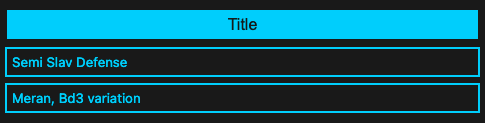
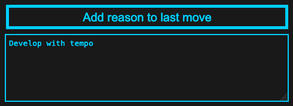

# Free Mode

Make moves for both colours

- Note: You will be tested as the colour you select here
- The computer will make moves on behalf of the opposite colour in Test Mode.

Save a title for the line, and an optional variation

You can also add a reason to a move. This will show up if you get stuck in Test Mode, and opt for a hint

Click Save when you're done, and head over to [Test Mode](./test-mode.md)
