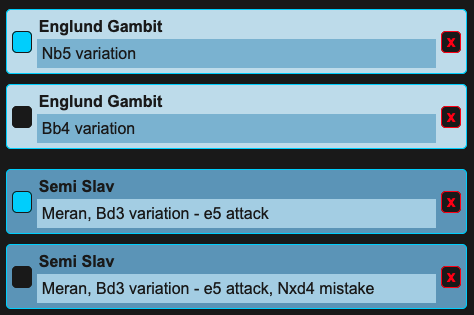

# List Mode

## Filter & select lines to test

Lines can be selected or deselected by checking the box on the left.
Selected lines will be tested. Deselected lines won't.

Show all, selected, or deselected lines

Filter lines by moves made

Filter lines by text

## A practical example

Let's say I want to practise the Semi Slav Defense from the Meran, Bd3 variation. I could simply:

- Search `Semi Meran Bd3`
- Click 'Desel all' to deselect all lines
- Click 'Select filtered' to select the search results

