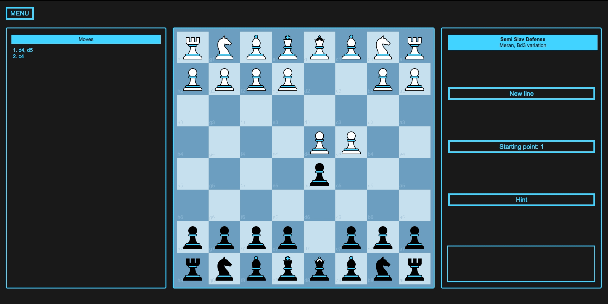

# Test Mode

## Test yourself against lines you've saved.

Incorrect moves aren't allowed

Correct moves trigger the next computer move

If you get stuck, click 'Hint' to display the piece to move, and the reason (if one was saved for that move)  
Click it again, and the target square will also be highlighted

When the final move in the line is made, another line will be loaded at random

## Custom starting points

By default, the first move in the line will be made for you, but you can set a custom starting point, if you want to practise many lines from a certain position

In the following example, I want to test myself against two variations of the Semi Slav Defense, Meran variation. One where White plays Bb3, and one where Bd3 is played. This distinction occurs at turn 8. So I set the starting point to 7. White then makes their move for turn 8, and I react.

---

To select/deselect lines for testing, head over to [List Mode](./list-mode.md)
